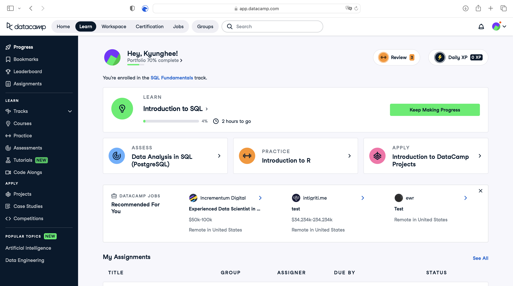

## Google Colab
For this course, we'll be using Google Colab to run Python code. Colab is a free cloud service that provides a Jupyter notebook environment. It allows you to write and execute Python code in your browser, with no setup required. You can also share your notebooks with others and collaborate in real time. **You will need a Google account to use Colab.**

Whenever you see this badge , click on it to open the notebook in Colab.

## DataCamp
DataCamp is an online learning platform that offers interactive courses in Python, R, SQL, and other data science tools. The platform is designed to help students learn by doing, with hands-on exercises and projects that are immediately applicable to real-world problems.

We'll be using DataCamp to complete the course exercises. You can access the exercises through the links in each module (look for this badge ) or through your DataCamp dashboard. If you haven't signed up, follow the instructions below to get started.

:::{hint} DataCamp Signup
* Use [this link][datacamp signup link] to sign up for DataCamp
* You must use your **@mcgill.ca** email address to sign up
:::

:::{hint} DataCamp Dashboard
:class: dropdown

* `Progress` on the sidebar to overview your progress
* `Assignments` for more detail on the exercises including due dates

:::

<!-- ## EdStem -->

[datacamp signup link]: https://